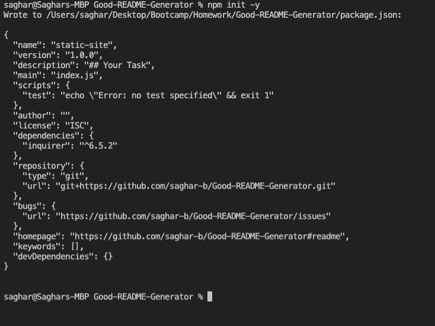
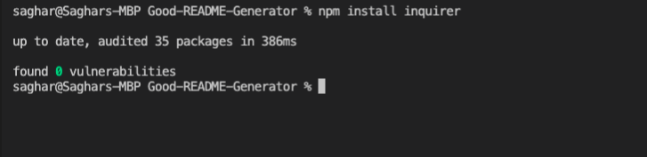
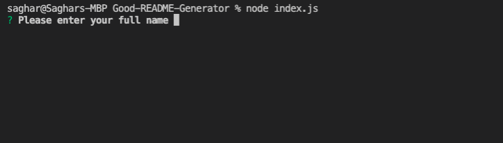
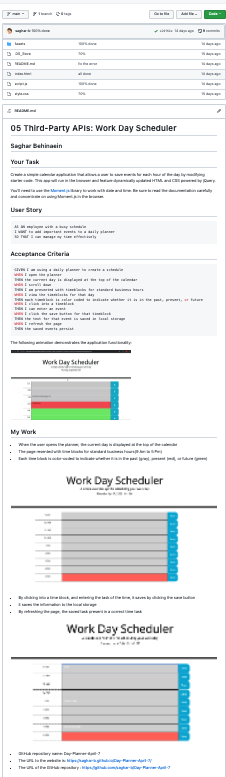
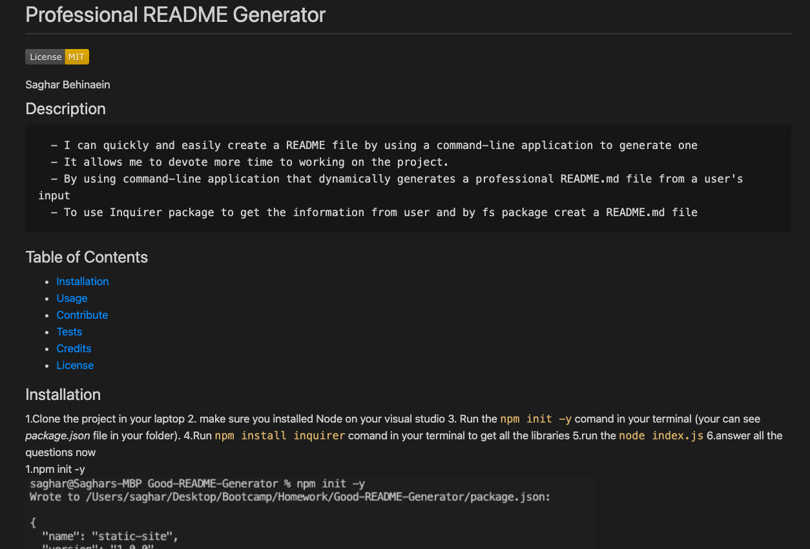

#  Professional README Generator 

  
    
####  Saghar Behinaein
    
## Description
    
      - I can quickly and easily create a README file by using a command-line application to generate one
      - It allows me to devote more time to working on the project.
      - By using command-line application that dynamically generates a professional README.md file from a user's input
      - To use Inquirer package to get the information from user and by fs package creat a README.md file
    
    
## Table of Contents 
    
- [Professional README Generator](#professional-readme-generator)
      - [Saghar Behinaein](#saghar-behinaein)
  - [Description](#description)
  - [Table of Contents](#table-of-contents)
  - [Installation](#installation)
  - [Usage](#usage)
  - [Contribute](#contribute)
  - [Tests](#tests)
  - [Credits](#credits)
  - [License](#license)
  - [Entitled Questions](#entitled-questions)

    
## Installation
1.Clone the project in your laptop  2. make sure you installed Node on your visual studio 3. Run the `npm init -y` comand in your terminal (your can see _package.json_ file in your folder). 4.Run `npm install inquirer` comand in your terminal to get all the libraries 5.run the `node index.js` 6.answer all the questions now   
1.npm init -y  
 

2.npm install inquirer   
  

3.node index.js
  

## Usage
    readme-md-generator will suggest you default answers by reading your package.json and git configuration.  
    The picture below is a picture of a README.md file  

## Contribute
    Not available for this project.

     
## Tests
I used another laptopn to creat a new README.md file.  
As you can see the in the picture below:   

## Credits
* The tutorial that I followed:  
    [Professional README Guide](https://coding-boot-camp.github.io/full-stack/github/professional-readme-guide)
    as a reminder of everything that a high-quality, professional README should contain.

* If you need help choosing a license, 
    refer to: [https://choosealicense.com/](https://choosealicense.com/).

## License
MIT License
      
            Copyright (c) 
            
            Permission is hereby granted, free of charge, to any person obtaining a copy
            of this software and associated documentation files (the "Software"), to deal
            in the Software without restriction, including without limitation the rights
            to use, copy, modify, merge, publish, distribute, sublicense, and/or sell
            copies of the Software, and to permit persons to whom the Software is
            furnished to do so, subject to the following conditions:
            
            The above copyright notice and this permission notice shall be included in all
            copies or substantial portions of the Software.
            
            THE SOFTWARE IS PROVIDED "AS IS", WITHOUT WARRANTY OF ANY KIND, EXPRESS OR
            IMPLIED, INCLUDING BUT NOT LIMITED TO THE WARRANTIES OF MERCHANTABILITY,
            FITNESS FOR A PARTICULAR PURPOSE AND NONINFRINGEMENT. IN NO EVENT SHALL THE
            AUTHORS OR COPYRIGHT HOLDERS BE LIABLE FOR ANY CLAIM, DAMAGES OR OTHER
            LIABILITY, WHETHER IN AN ACTION OF CONTRACT, TORT OR OTHERWISE, ARISING FROM,
            OUT OF OR IN CONNECTION WITH THE SOFTWARE OR THE USE OR OTHER DEALINGS IN THE
            SOFTWARE.

## Entitled Questions
    if you have more information, please contact me through  
     
[my GitHub ](https://github.com/saghar-b)  
[my email ](behinaeen.saghar@gmail.com)  
        